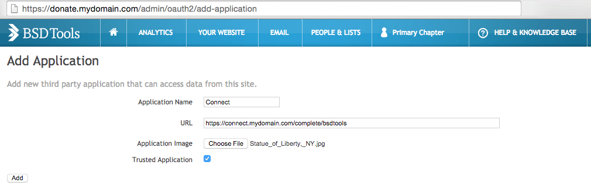
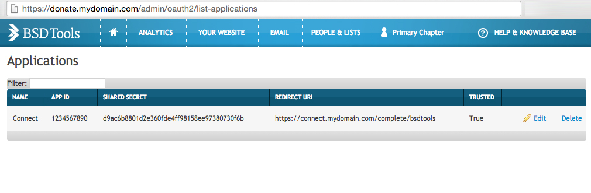

***********************
Authentication Backends
***********************

Connect does not have a built-in authentication system and instead relies on the `Python Social Auth`_ library and third party authentication providers.

.. _Python Social Auth: http://psa.matiasaguirre.net/

NGP VAN ActionID
================

By default Connect uses the `NGP VAN`_ ActionID_ OAuth1 authentication backend. ActionID is the same backend that is used as part of NGP VAN's VAN product, allowing users to use the same username and password to login to both VAN and Connect.

Using ActionID requires no work on your end, however there will be an opt-in step after users first attempt to login to your version of Connect using ActionID.

NGP VAN is able to "white list" certain installations of Connect based on hostname. This is already done for ``http://localhost``, but by contacting `NGP VAN Developer Support <http://developers.ngpvan.com/support/contact>`_ you may be eligible to have that authorization step removed.

.. _NGP VAN: https://www.ngpvan.com/
.. _ActionID: http://developers.ngpvan.com/action-id

Blue State Digital Tools
========================

Connect ships with built-in support for `Blue State Digital`_'s BSDTools_ tool-set, via BSDTools' OAuth2 provider service. This allows users to login to Connect using the same login that they use to login to the BSDTools event platform.

.. note::
    It's recommended you contact Blue State Digital support for more information regarding implementing an OAuth2 consumer for Connect.

Adding OAuth2 Applications to BSDTools
^^^^^^^^^^^^^^^^^^^^^^^^^^^^^^^^^^^^^^

To create a new endpoint, go to the "Add Application" page (located at ``https://bsd.clientdomain.com/admin/oauth2/add-application``) and enter your "Application Name" as "Connect", "URL" as the full secure hostname of your BSD installation

When creating a new OAuth2 application you'll find 4 fields necessary:

* **Application Name** The internal name that this OAuth2 application will be referred to as within BSDTools
* **URL** The "Redirect Url" that BSDTools will send users to after they've successfully authenticated. This must be in the format (assuming your copy of Connect is located at ``https://connect.yourdomain.com``) ``https://connect.yourdomain.com/complete/bsdtools``
* **Application Image** A thumbnail used by BSDTools and displayed to the user if the application is not marked as "Trusted." Not usually publicly viewable.
* **Trusted Application** If an application is marked as "Trusted" BSDTools will immediately log a user into Connect after they log into the tools. In addition, if the user is already authenticated on BSDTools (perhaps after using BSDTools' event functionality) they will be immediately and transparently logged into Connect if this is checked.
  

Example:

.. note::
    If you're testing Connect locally with a port (such as ``http://localhost:8000``) you'll need to set the **URL** to ``http://localhost:8000/complete/bsdtools``

Listing Available OAuth2 Applications in BSDTools
^^^^^^^^^^^^^^^^^^^^^^^^^^^^^^^^^^^^^^^^^^^^^^^^^

Once you've created your application you'll need the ``APP ID`` and ``SHARED SECRET``. You can find this by going to the "List Applications" page (located at ``https://bsd.clientdomain.com/admin/oauth2/list-applications``) and finding the application you recently created.

Configuring Connect to use BSDTools
^^^^^^^^^^^^^^^^^^^^^^^^^^^^^^^^^^^

You'll need to then update Connect with the following settings:

* ``DEFAULT_AUTH_BACKEND`` should be set to ``connect_extras.auth_backends.bsdtools.BSDToolsOAuth2``
* ``BSDTOOLS_INSTANCE`` should be set to the secure hostname of your BSDTools installation (i.e. ``donate.mydomain.com``)
* ``BSDTOOLS_KEY`` should be set to your ``APP ID``
* ``BSDTOOLS_SECRET`` should be set to your ``SHARED SECRET``

If you're relying on BSDTools authentication for local development, you'll need to make sure that individual developers are using the same hostnames for testing, as the URL you enter in the Add-Application step will change.

.. warning::
    **Never merge or de-dupe constituents who have linked Connect accounts.** Connect user accounts are linked to BSDTools Constituent ID numbers, so some actions Administrators can take may trigger BSDTools' de-duping systems which can cause Connect users to lose access to their accounts and make it impossible for them to create new accounts.

    Be extremely careful when importing new constituents or modifying constituent primary email accounts in your BSDTools administration panel so that you do not attempt to re-import Connect users. And **never use the merge_constituents_by_email or merge_constituents_by_id API calls on Connect accounts**

.. _Blue State Digital: https://www.bluestatedigital.com/
.. _BSDTools: https://tools.bluestatedigital.com/
