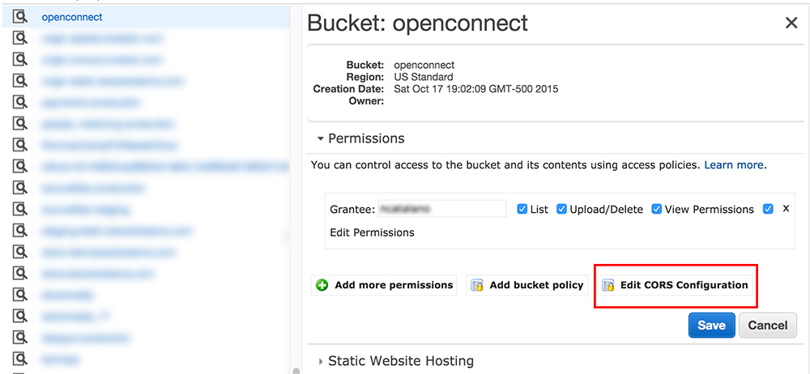
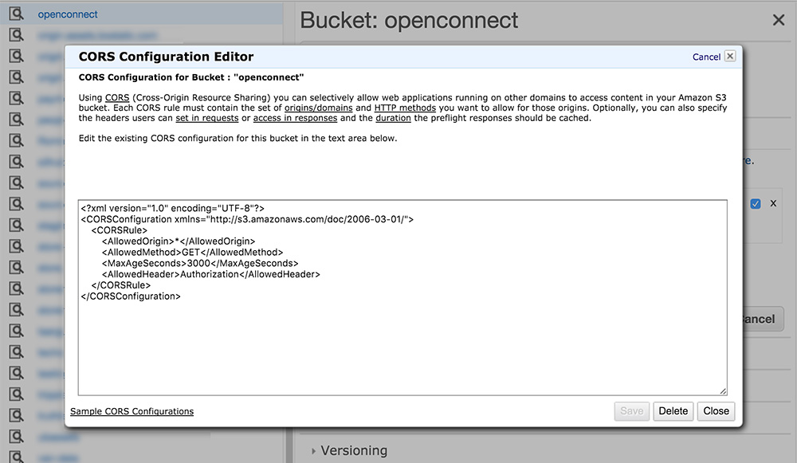

**********************************
Hosting Connect Fonts on Amazon S3
**********************************

Connect relies on webfonts for some parts of the UX. Many browsers restrict the hosting of webfonts to only those with an explicit `Cross-origin resource sharing`_ (CORS) policy.

If you're relying on Amazon S3 to store static assets, you're able to assign a CORS policy per-bucket. This policy is defined using an S3-specific XML schema. For details about a custom CORS policy, view the `Amazon S3 CORS Documentation`_.

By far the easiest way to configure CORS is by `editing bucket permissions in the AWS Management Console <https://docs.aws.amazon.com/AmazonS3/latest/UG/EditingBucketPermissions.html>`_.

To edit the cors configuration, go into the S3 secton inside teh AWS console, then click the button and press "Properties." You'll see a button labeled "Edit CORS Configuration" for you to edit.

You should see a text box pop-up in a modal which is pre-filled with a "Allow all origins to GET content" policy available by default. This should be fine for most uses.

If the textfield does not prefill, you can use this code:

.. code-block:: xml

    <?xml version="1.0" encoding="UTF-8"?>
    <CORSConfiguration xmlns="http://s3.amazonaws.com/doc/2006-03-01/">
        <CORSRule>
            <AllowedOrigin>*</AllowedOrigin>
            <AllowedMethod>GET</AllowedMethod>
            <MaxAgeSeconds>3000</MaxAgeSeconds>
            <AllowedHeader>Authorization</AllowedHeader>
        </CORSRule>
    </CORSConfiguration>

.. _Cross-origin resource sharing: https://en.wikipedia.org/wiki/Cross-origin_resource_sharing
.. _Amazon S3 CORS Documentation: https://docs.aws.amazon.com/AmazonS3/latest/dev/cors.html
