*******************
Administrator Guide
*******************

This guide will cover features that are exclusive to all Connect administrators, including:

* Creating a new group
* Adding resources to groups
* Connect administrator features, accessed from the Admin menu, including:
* Message moderation
* Flag moderation log
* Group moderation
* Admin gallery
* Invites
* User reports
* Group reports

The guide will also cover features that are exclusive to Connect super-administrators, including managing other Connect users, and additional features accessed from the Admin menu:

* Popular URLs
* Category admin
* Tag admin

Creating A New Group
====================

Connect administrators can create new groups by clicking the **Explore** option on the Connect navigation bar.

From the Groups page, click the plus (+) sign to create a new group.

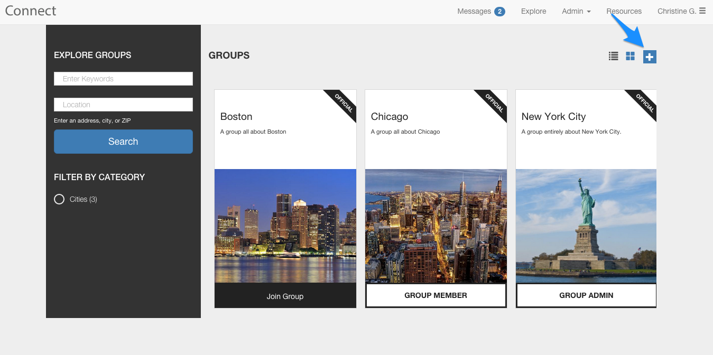

On the **Create a Group** page, you can create and customize a new Connect group. While creating your group, give it a (1) name, category and description, and (2) a profile picture.

You'll also have the opportunity to add (3) additional group administrators, called **Owners** here, and (4) users who are whitelisted, whose messages will bypass moderation.

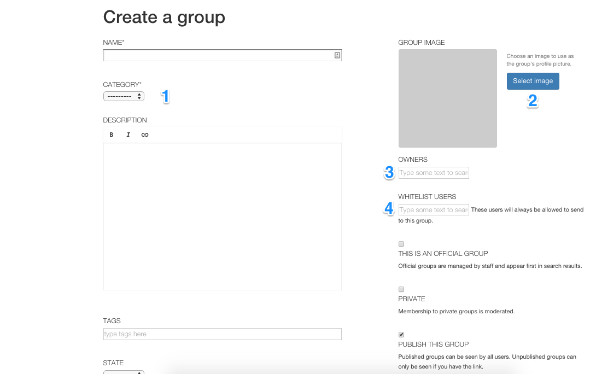

On this page, you'll also decide (1) whether or not the group is official (managed staff members of your organization), (2) if other users can join the group without being invited, (3) whether or not the group will appear to other Connect users, (4) if posts to the group are moderated, and (5) if other users can see who is a member of the group.

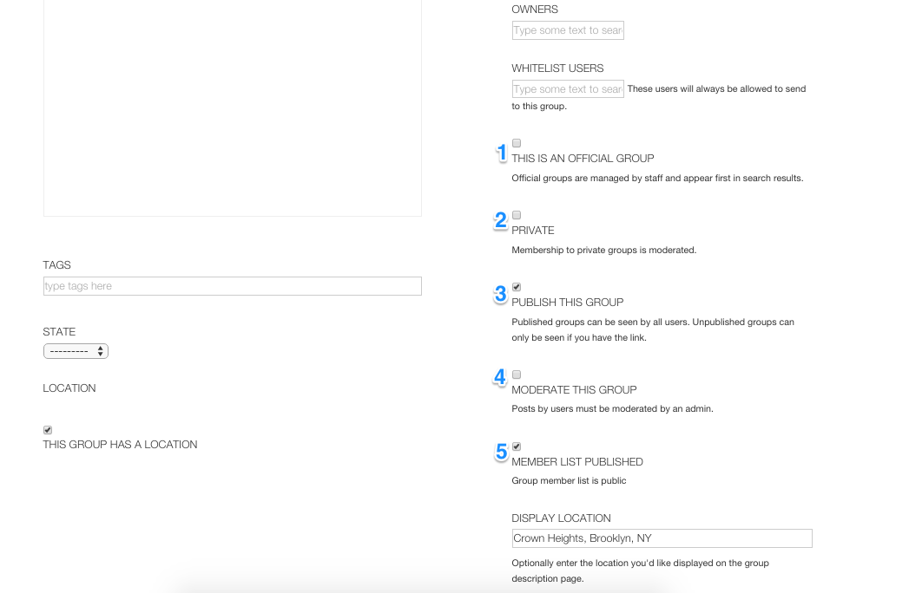

If your group has a location, you'll choose where (1) the group is located, and (2) pick a display location that will show on your group description. Finally, click the **Create group** button to create your group.

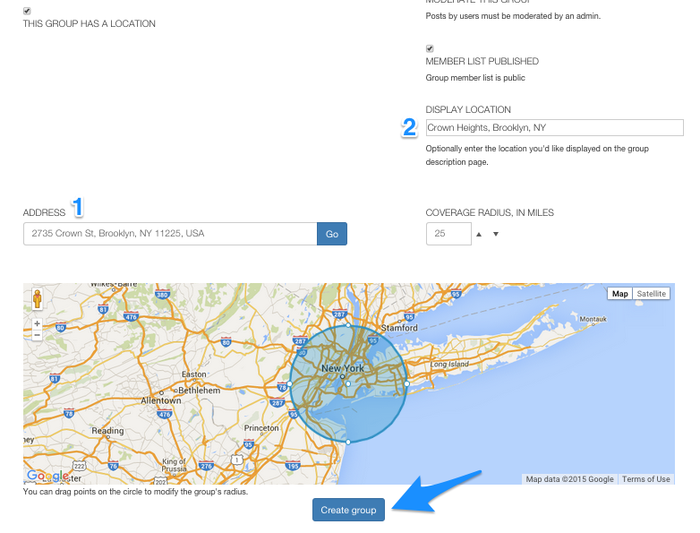

Resources
=========

As a group administrator, you can add resources, such as pdf files, word documents, and images, to share with members of your groups by clicking the **Resources** option on the Connect navigation bar.

From the **Resources** page, click the plus (+) sign to add resources.

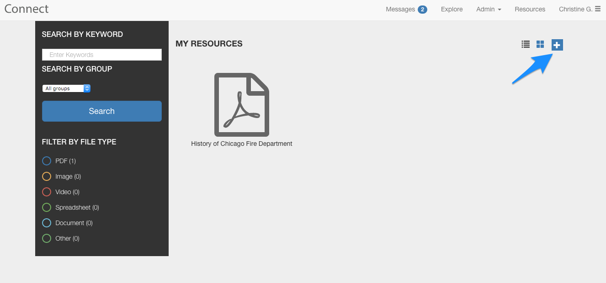

From the **Upload a File** page, (1) you can choose your file to upload, (2) give the file a name, (3) choose the group you'd like to share the file with, and (4) assign the file tags, or keywords, which will allow users to search for the file.

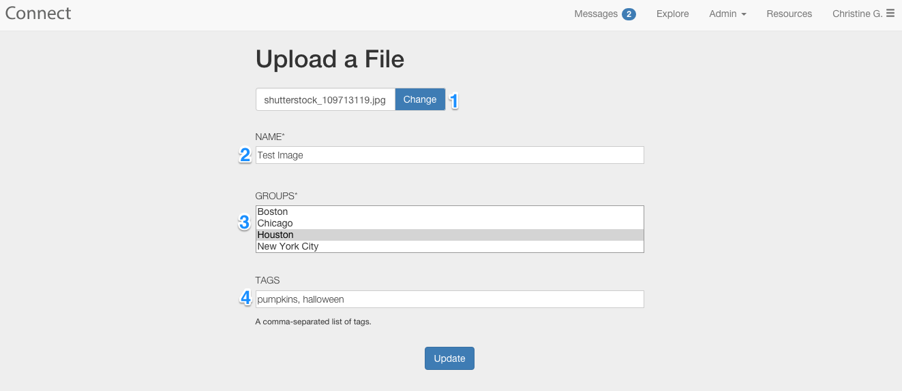

When you return to the **Resources** page, you'll be able to edit or delete any resources you've added.

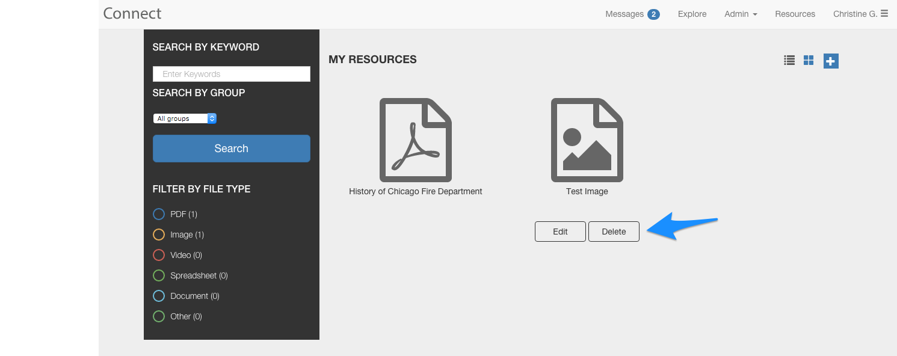

Message Moderation
==================

In this section, we'll cover (1) finding messages to moderate and (2) moderating messages.

1. Finding messages to moderate

From any screen on Connect, the **Messages** option in the navigation bar will indicate the total number of messages available for you.

This number includes: unread messages from groups you're a member of, messages pending moderation, or pending group join requests.

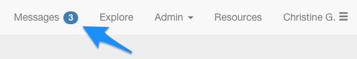

To access the **Message Moderation** panel, Connect administrators have two options:

A. Click the **Messages** from the Connect navigation bar to go to your Connect inbox. From there, click the link that says **You have messages to moderate**.

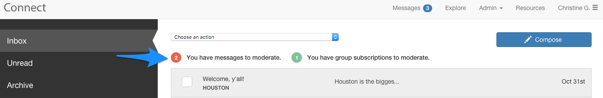

B. Choose **Message Moderation** from the Connect navigation bar

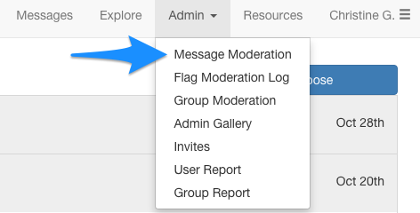

2. Moderating messages

From the **Message Moderation** panel, you'll see a preview of the messages available to moderate.

To see the full message pending, in context of the thread it was posted to, click the subject line of the message.

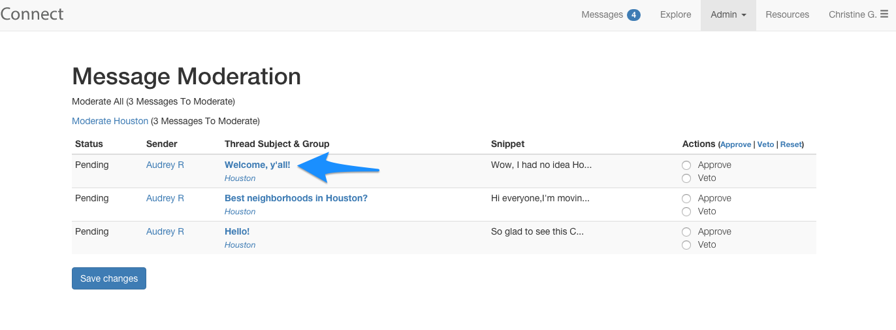

Now you can read the entire message, and where it fits within the thread. Click the arrows at the bottom of the page to expand and contract the view of the entire thread.

.. image:: images/image05.png

Back in the **Message Moderation** panel, you can choose to **Approve** or **Veto** (reject) messages from your group in two ways. (1) Click the **Approve** or **Veto** button associated with each message, or, (2) moderate all messages in bulk by clicking the **Approve** or **Veto** options next to Actions. Then click (3) **Save changes**.

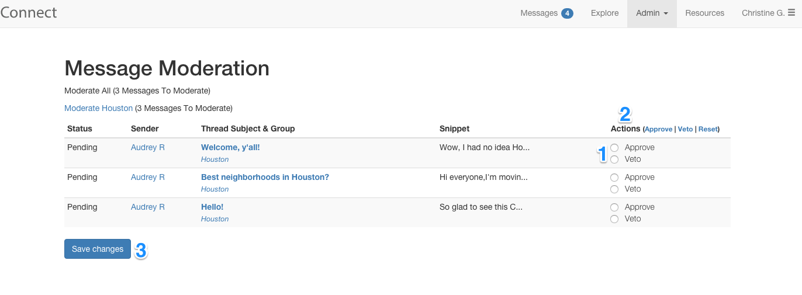

Flag Moderation Log
===================

Any member of a group can flag messages as inappropriate by clicking the flag icon located on the bottom right corner of a message.

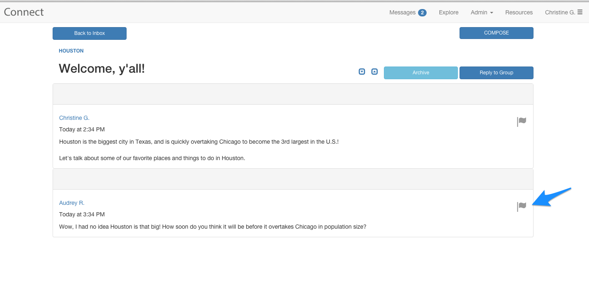

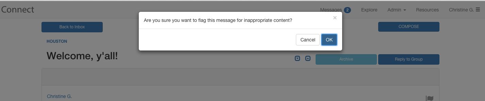

Once the message is flagged, it is removed from view by all group members, except the member who originally posted the message.

Flagged messages will appear in your **Message Moderation** panel for further review. If you decide to veto a message, it will be permanently removed from the group. If you choose to approve the message, it will be returned to the group.

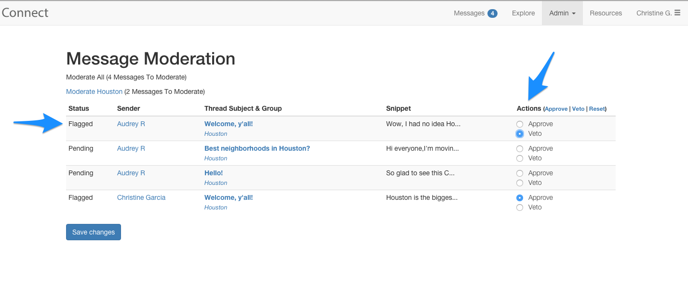

When a flagged message is either approved or vetoed, it will appear in your **Flag Moderation Log**, You can access the **Flag Moderation Log** from the **Admin** menu on the Connect navigation bar.

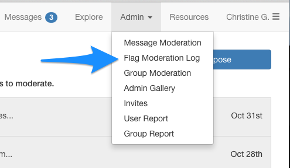

In the **Flag Moderation Log**, you can see (1) the subject line of the flagged message, (2) who flagged the message and when, (3) who moderated the message and when, and (4) the action taken on the message.

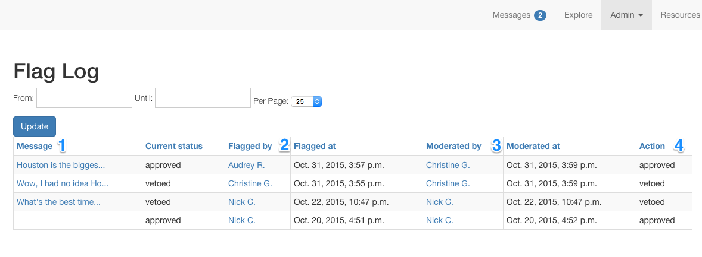

The **Flag Moderation Log** is especially helpful if you have multiple administrators in a single group.

Group Moderation
================

If your group is private, users must request to join your group. You can access the **Group Moderation** panel from the **Admin** menu on the Connect navigation bar.

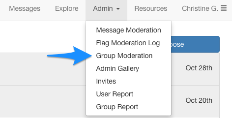

From the Moderate your join requests panel, you can select individual or all pending group join requests. Select the users whose join requests you'd like to approve or reject, and click **Save changes**.

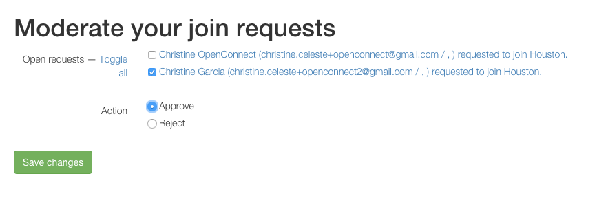

Admin Gallery
=============

Access the **Admin Gallery** panel from the **Admin** menu on the Connect navigation bar.

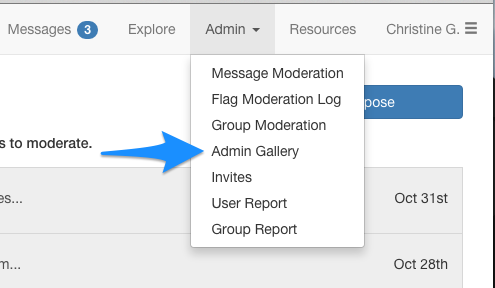

In the **Admin Gallery**, you can find images that have been shared in Connect groups, and see how many times each has been viewed.

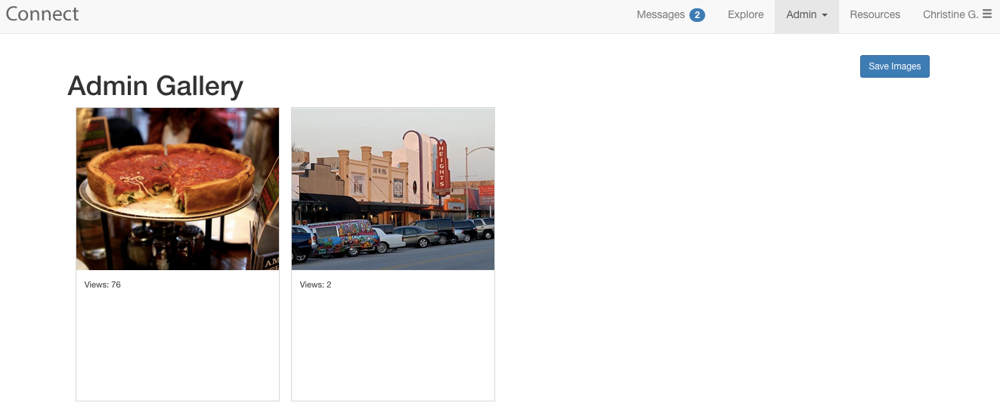

You can also (1) select images individually, or select all images, and (2) save them to a Dropbox account.

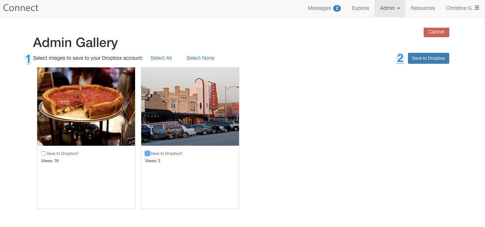

User Report
===========

Access the **Admin Gallery** panel from the **Admin** menu on the Connect navigation bar.

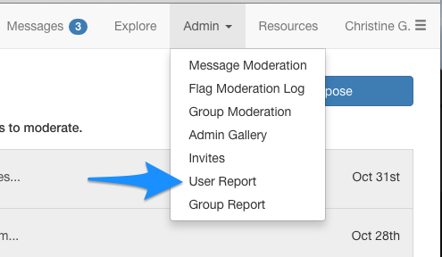

In the **User Report**, you can find information on who has joined Connect. You can access the **User Report** panel from the **Admin** menu on the Connect navigation bar.

In the **User Report**, you can find information on when individual users including:

* The user's first name and last initial
* The user's email address
* When the user joined Connect
* The user's last login date
* The number groups the user has joined
* The number of messages the user has sent
* The number of messages the user has flagged
* The number of times the user has visited the site.
* The user's current status on Connect—If they have been banned or have unsubscribed since joining

You can also export this information as a .csv file.

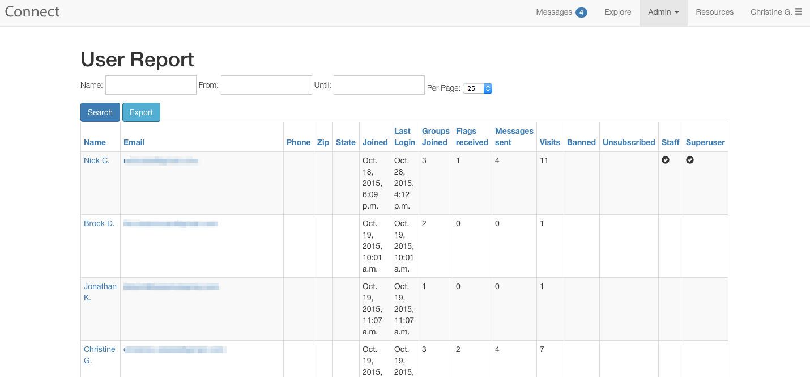

Group Report
============

Similar to the **User Report**, in the **Group Report** you can find information about groups on Connect. You can access the **Group Report** panel from the **Admin** menu on the Connect navigation bar.

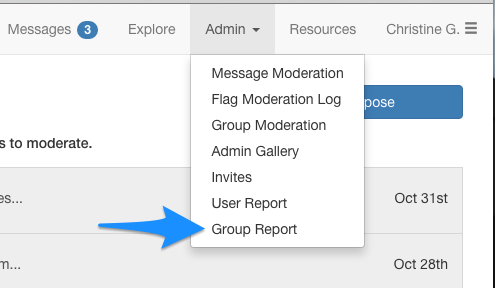

In the **Group Report**, you can find information on groups including:

* Names of groups
* The total number of messages sent within the group
* The number of threads started in the group
* The number of replies
* The number of users posting to the group
* The group category and location
* The total number of group members
* The privacy level of the group
* The original creator of the group

You can also export this information as a .csv file.

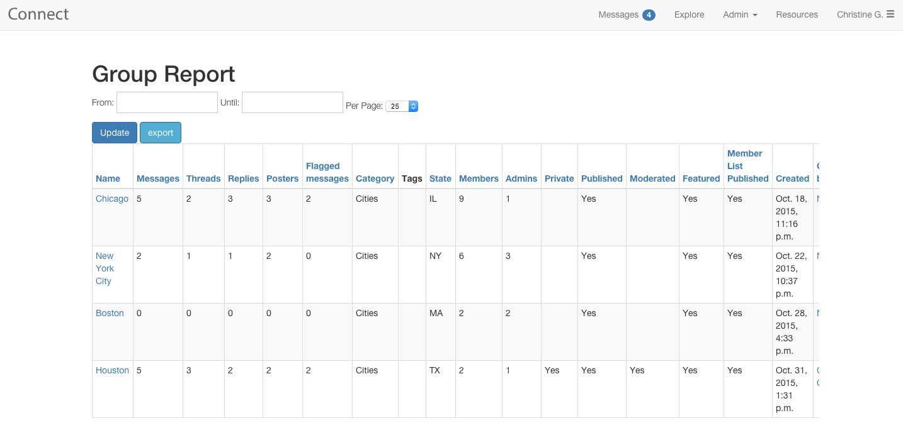

Popular URLs
============

**Super Administrators Only**

If you're interested in finding the top URLs being shared across Connect, you can access a **Popular URLs** report from the **Admin** menu on the Connect navigation bar.

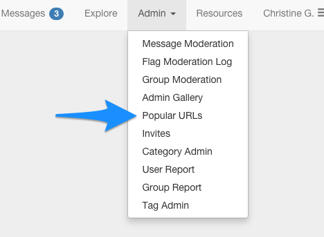

From the **Popular URLs** report, you can sort URLs by create date, the number of messages associated with the URL, and the number of clicks the URL has received.

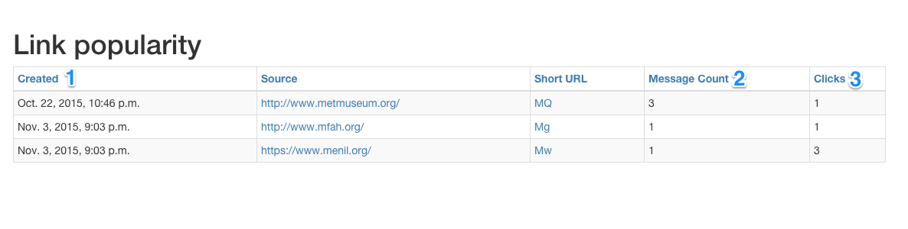

Category Admin
==============

**Super Administrators Only**

In the **Category Admin** feature, you can add more categories for Connect groups. **Category Admin** is accessible from the **Admin** menu on the Connect navigation bar.

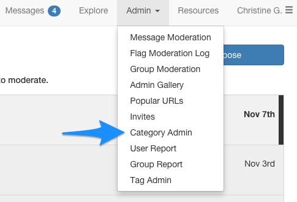

In **Category Admin**, you can add new categories, edit existing categories, and find information on the editing history of categories.

To (1) edit an existing category, simply click the name of the category to access the editing panel. To (2) add a new Connect category, click the **Add Category** button. And, if you'd like to (3) delete a category, click the box next to the category name, then click **Delete selected categories** from the **Action** dropdown.

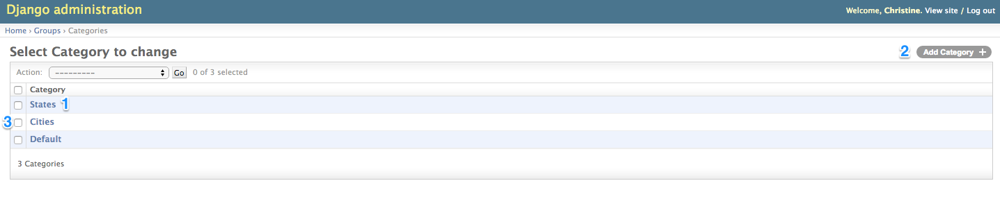

When you click the name of a category to change it, you can also view the editing history of that category.

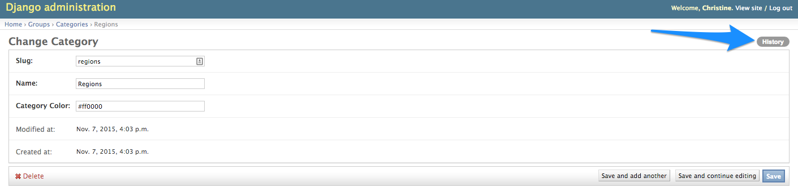

Here you find out when a change action was taken, by which user, and the type of action taken.

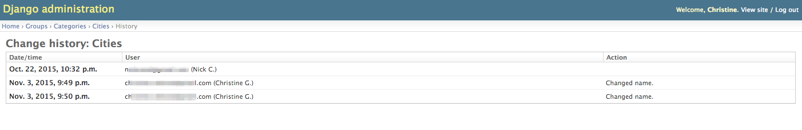

To add a new category, from the **Category Admin** panel, click **Add Category**.

You'll need to first (1) choose a slug for your group. The slug assigns a name to the exact location of your group within the site. Then, (2) choose a name for your category, to be displayed on the **Explore** page. You can also (3) adjust color of the category name by assigning a color using hexadecimals.

Then click **Save** to continue editing, add more categories, or exit to the **Category Admin** panel.

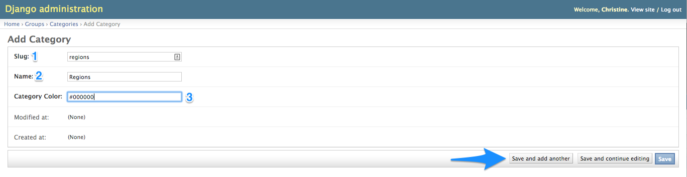

After you add a new category, you&#39;ll need to add a group to your new category for it to appear in **Explore**.

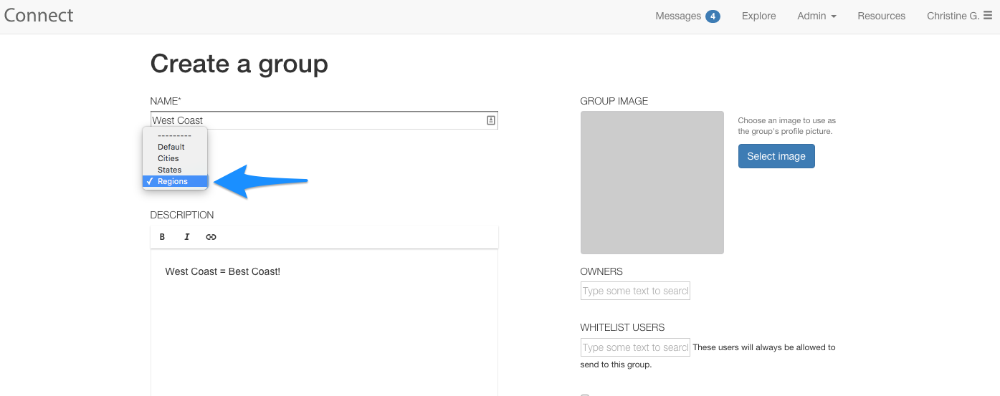

Now that you've created a group in the new category, you can find it in the **Explore** page.

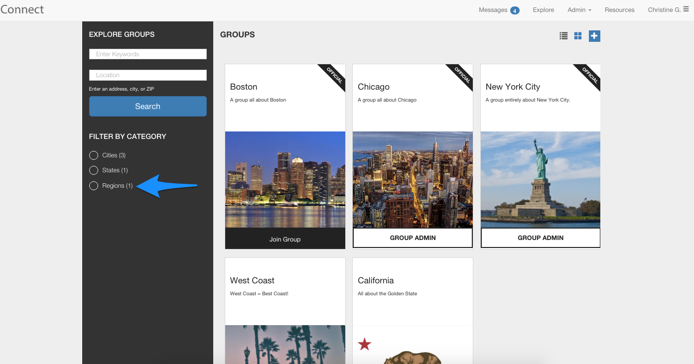

Tag Admin
=========

**Super Administrators Only**

If you'd like to change the tags associated with the files in your resources section, or add new tags, you can do that in the **Tag Admin** feature. **Tag Admin** is accessible from the **Admin** menu on the Connect navigation bar.

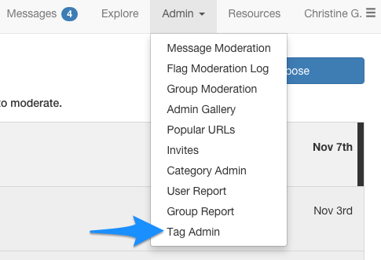

To (1) edit an existing tag, click the name of the tag to access the editing panel. To (2) add a new tag, click the **Add Tag** button. And, if you'd like to (3) delete a tag, click the box next to the tag name, then click **Delete selected tags** from the **Action** dropdown.

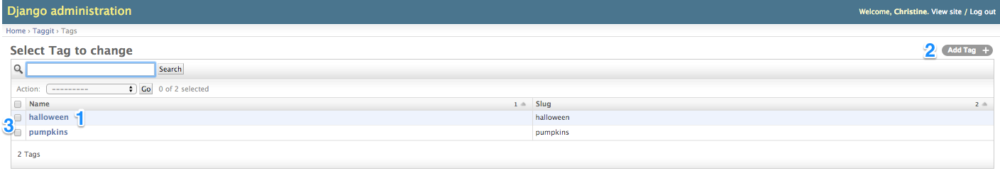

By clicking an existing tag, you can edit the name of the tag and find the editing history of the tag.

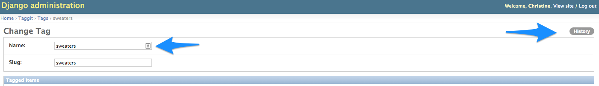

In the **History** section, you find out when a change action was taken, by which user, and the type of action taken.

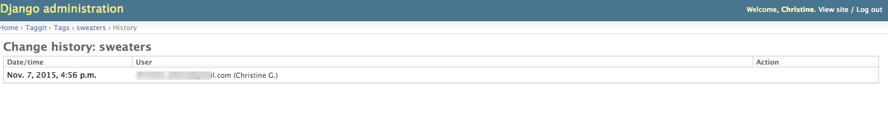

To add a new tag, from the **Tag Admin** panel, click **Add Tag**.

You'll need to first (1) choose a slug for your tag. The slug assigns a name to the exact location of your tag within the site. Then, (2) choose a name for your tag, to be displayed with the resources associated with your tag. Then click **Save** to continue editing, add more categories, or exit to the **Tag Admin** panel.

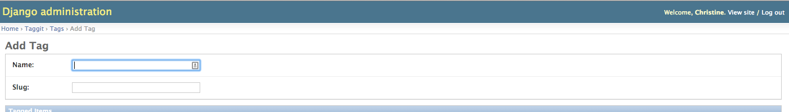

Now that your tag has been created, you can add it to Connect resources.

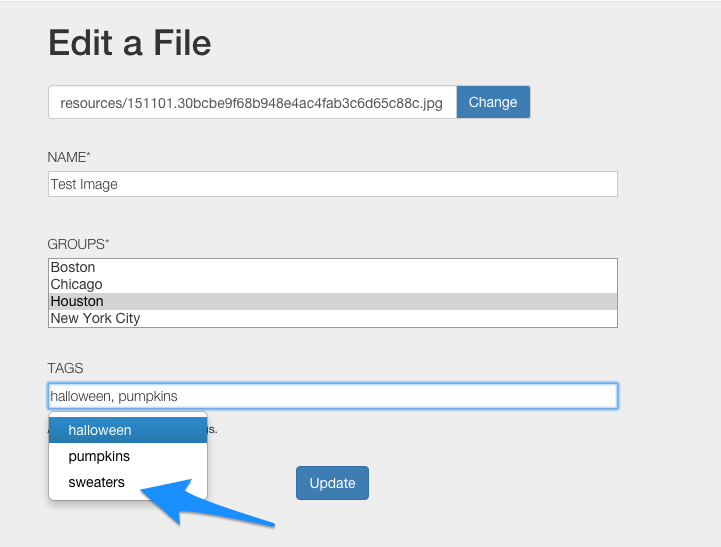

Managing Other Connect Users
============================

**Super Administrators Only**

If you have super-administrator privileges on Connect, you can manage the profiles of other Connect users. This includes (1) banning the user, (2) becoming the user, (3) updating the user's profile, and (4) updating the user's permissions.

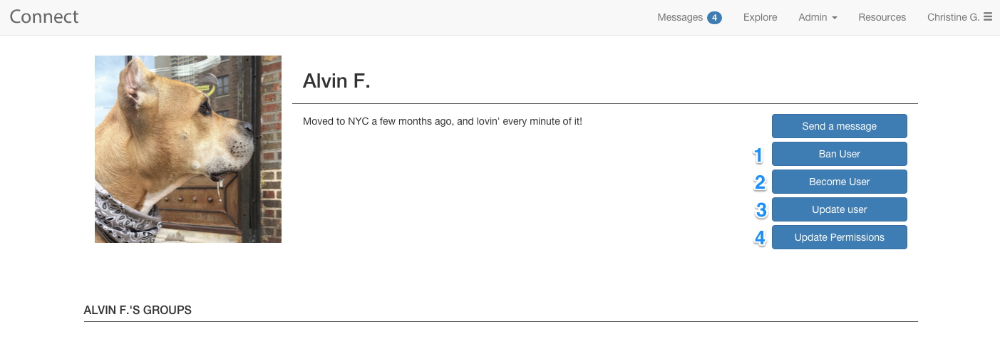

Find the Connect users you'd like to manage via the **User Report** in the **Admin** menu of the Connect navigation bar.

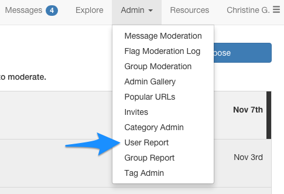

From the **User Report**, search for the user whose account you'd like to manage, and click on their name.
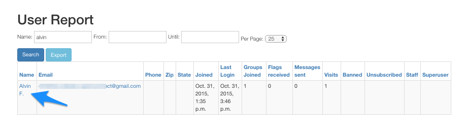

Once you have accessed a user's profile, you can take the steps mentioned above: **Ban User**, **Become User**, **Update User** and **Update Permissions**.

Ban User
--------

Click (1) **Ban User** to ban the user from Connect. When you ban a user, their messages will only be visible to themselves --other Connect users will no longer see their messages. To ban a user, click the box next to Are you sure you want to ban this user? and click **Save**.

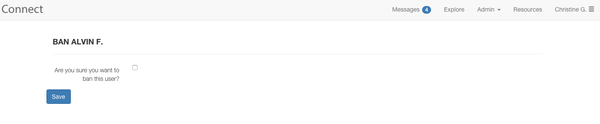

Become User
-----------

If you'd like to find out more information about a user's activity on Connect, click (2) **Become User** to view Connect as the user would.

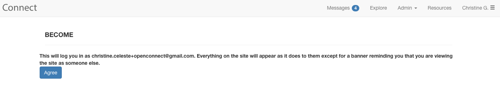

You will see a red banner informing you of which user's account you're current viewing Connect as, and a link to return to your own account.

You can now view the user's Connect messages and profile, as the user would. From the user profile, you can also edit their profile information.

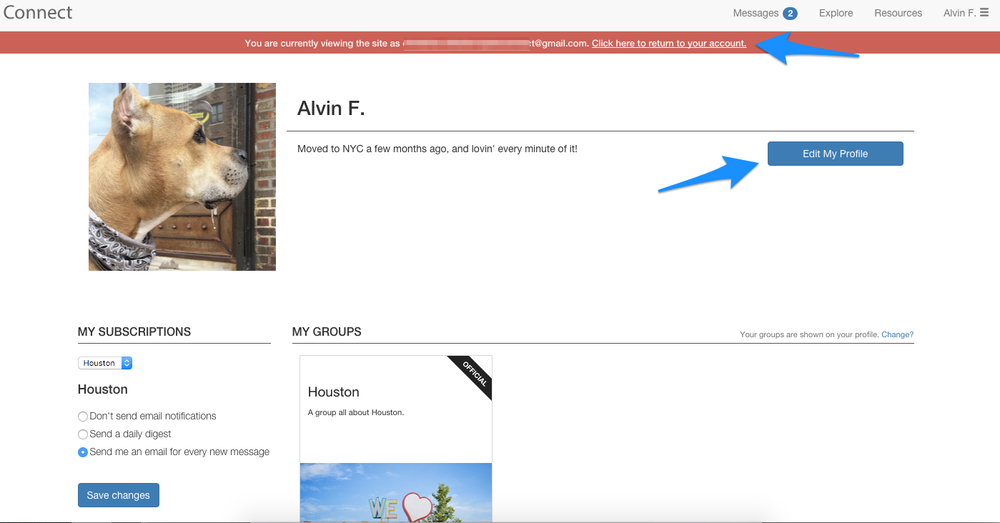

Update User
-----------

To quickly update a user's profile information, click (3) **Update User**. You'll be able to update their profile information on their behalf.

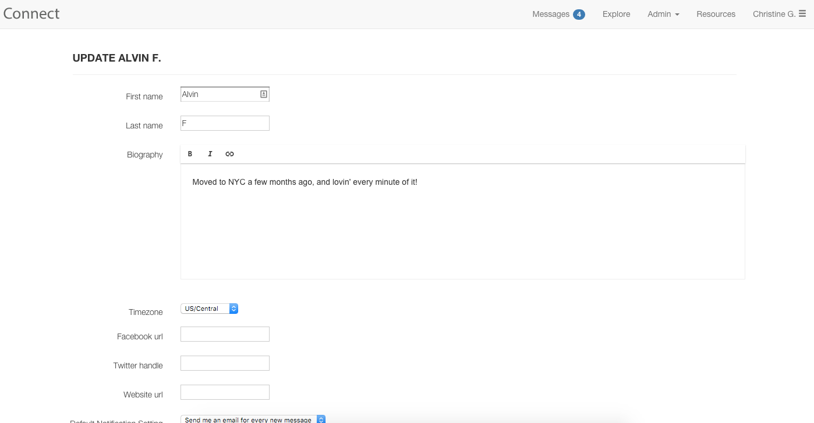

Update Permissions
------------------

To give a user additional Connect permissions, click (4) **Update Permissions**. From the permission update panel, you'll be able to give the user additional Connect privileges, such as the ability to edit other user's accounts, create groups, and add resources.

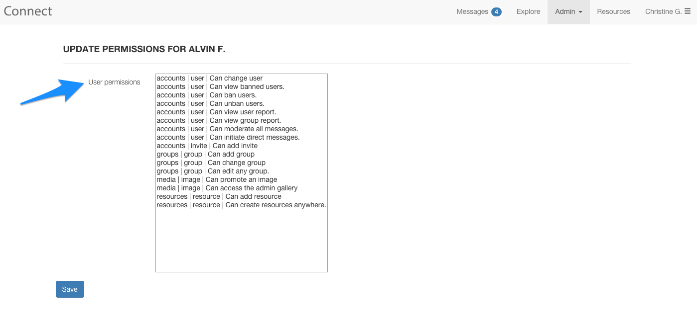
