**********
User Guide
**********

This guide will cover basic features available to all Connect users, including:

* Creating a Connect account
* Your Connect profile
* Connect groups
* Messages on Connect
* Managing your Connect inbox
* Accessing resources on Connect
* Managing your Connect subscriptions

Creating An Account
===================

To access Connect, you will need to log in or create an account.

.. image:: images/image47.png

If you're creating an account, be sure to use the email address where you'd like to receive Connect messages and notifications. You will use this email address to log in to your Connect account moving forward. At this time, you will not be able to change your email address once it is set.

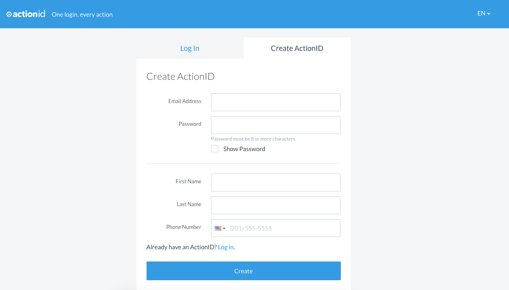

After your account has been created, you will be redirected to the Explore page on Connect. From here, you can find out which groups are available to join.

Using the navigation bar at the top of any screen on Connect, you can access this page again at any time by clicking **Explore**.

You will also need to read and accept the Connect Terms of Service before you can proceed within Connect.

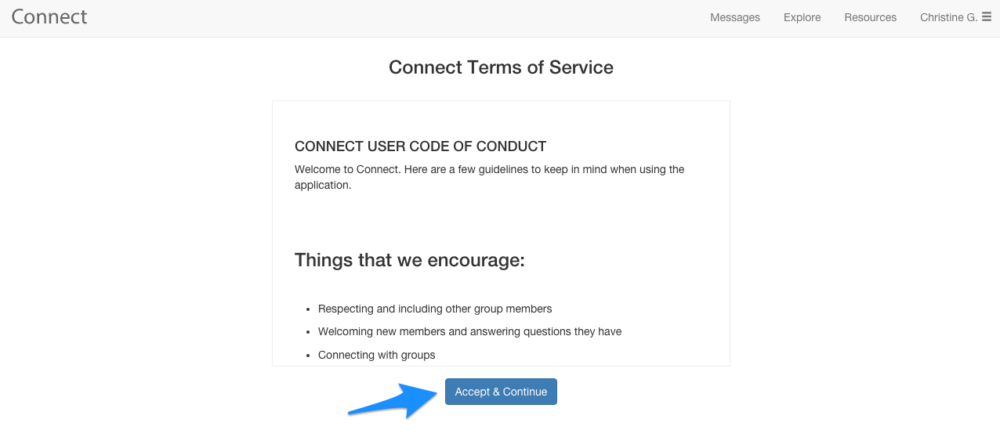

Your Connect Profile
====================

Before joining groups, it's a good idea to create your Connect profile—that way, Connect group administrators will be able to find out more about you and what you're interested in.

In this section, we'll cover (1) creating your profile and (2) viewing your profile and changing your profile picture.

1. Creating your profile

From the Connect navigation bar, click the three lines on the far right side. A menu will open displaying the following options: **My Profile**, **Manage My Account** and **Logout**.

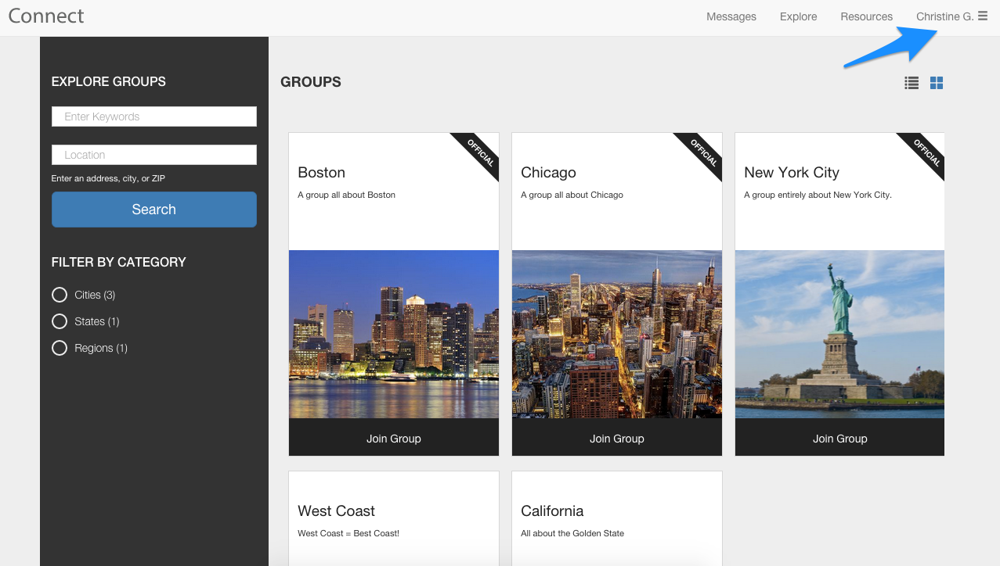

To create your profile, click Manage My Account.

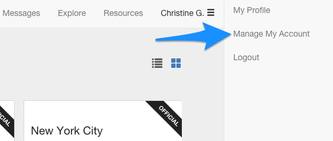

From the Manage My Account panel, you'll be able to:

Add your name—it will be displayed to other Connect users.

Fill out your biography. Share a little about yourself and why you're on Connect.

Indicate your current timezone. Make sure messages are displayed to you using the appropriate time.

Add your social media profile and website links.

Choose your default email notification settings. These settings determine how often you will receive Connect messages via email. (Find additional details on this below.)

Decide whether or not you'd like groups you're a member of displayed on your profile. If a group you're a member of has been set as private by the group administrator, only other members of that group will be able to see it on your profile.

Set a profile picture. This picture will be displayed on your profile, as well as next to your name in groups you're a member of. (Find additional details on this below.)

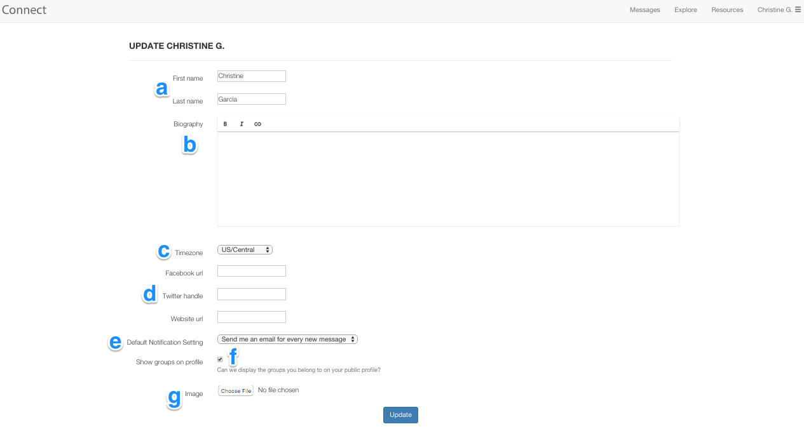

To (e) update your default notifications, click the drop down menu and choose whether you'd like to receive an email for every new message you receive on Connect, receive a daily digest of messages, or receive no notifications.

After you've joined groups, you'll be able to further refine these settings on your profile.

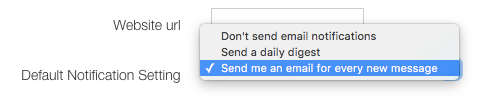

To (g) add a profile picture, click **Choose File** and select the image you'd like to use for your profile picture.

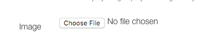

When you're done filling out your profile, click Update to save your changes.

2. Viewing Your profile and changing your profile picture

After you click **Update** on the **Manage My Account** panel, you'll be redirected to your completed profile.

If you decide at this point to make additional updates to your profile, you can do that by clicking **Edit My Profile**. You will be sent back to the **Manage My Account** panel.

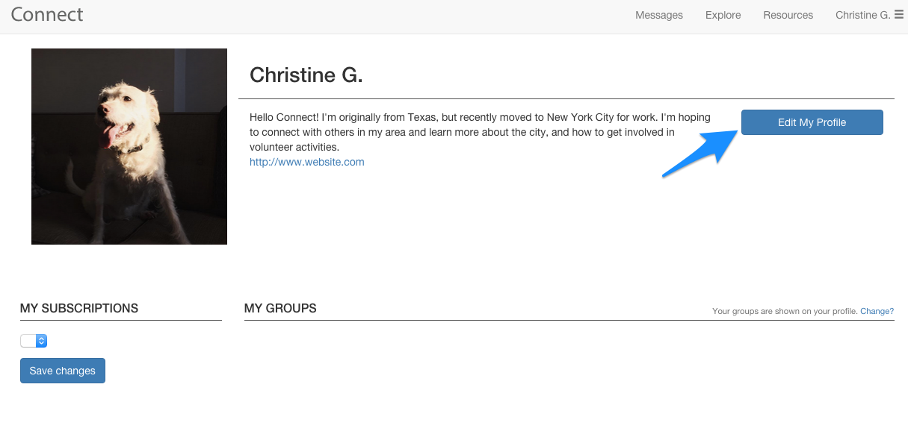

You can also access your profile (**My Profile**) or the profile editing feature (**Manage My Account**) from anywhere on Connect by clicking the three lines on the Connect navigation bar.

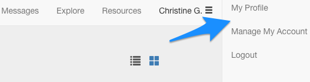

If you'd like to change your profile picture, you'll need to clear the original picture by checking the box marked Clear, then choose new profile picture and click **Update**.

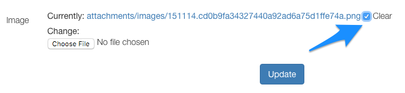

Connect Groups
==============

Now that your profile is complete, the next step in using Connect is joining groups. In this section, we'll cover:

1. Finding groups to join

2. Joining groups

3. Exploring groups

4. Leaving groups.

1. Finding groups to join

To access a list of groups that are available for you to join, click **Explore** on the Connect navigation bar.

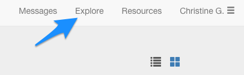

If you'd like to refine the list of groups being displayed, you can search for groups with keywords or by searching a location. You can also filter by group category—just click the name of the category you'd like displayed.

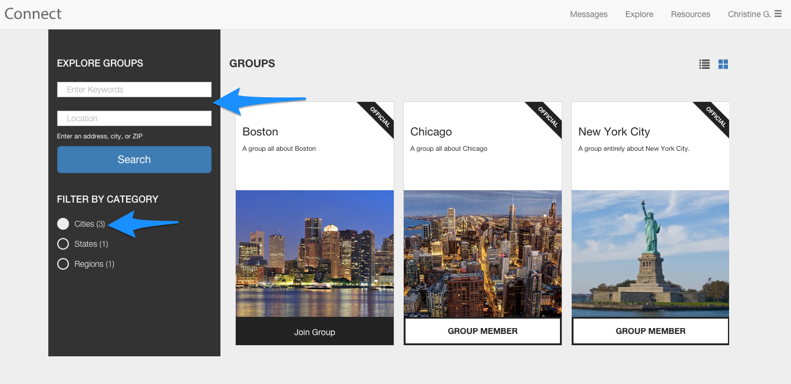

2. Joining groups

To join a group, click (1) **Join Group** on the group listing. You will receive (2) an instant confirmation indicating you have successfully joined the group.

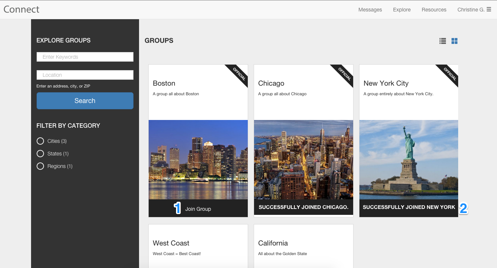

You can also click the group name to preview the group, and will have the option to join the group from that page, as well.

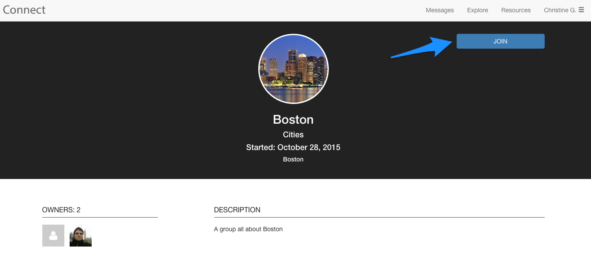

When you re-visit the Explore page, you will be able to see which groups you're currently a member of.

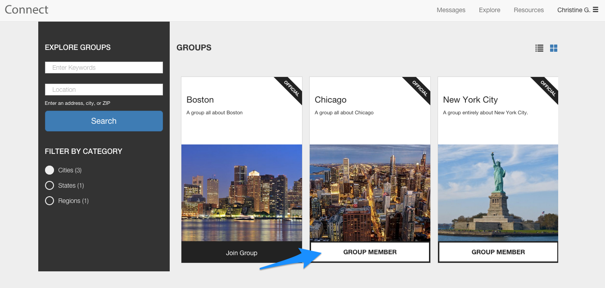

3. Exploring groups

Once you're a member of a group, you can find (a) more details about the group, (b) who is in your group, and (c) access resources that are available to members of your group.

If you'd like to (b) find out who else is a member of your group, click **See all members**.

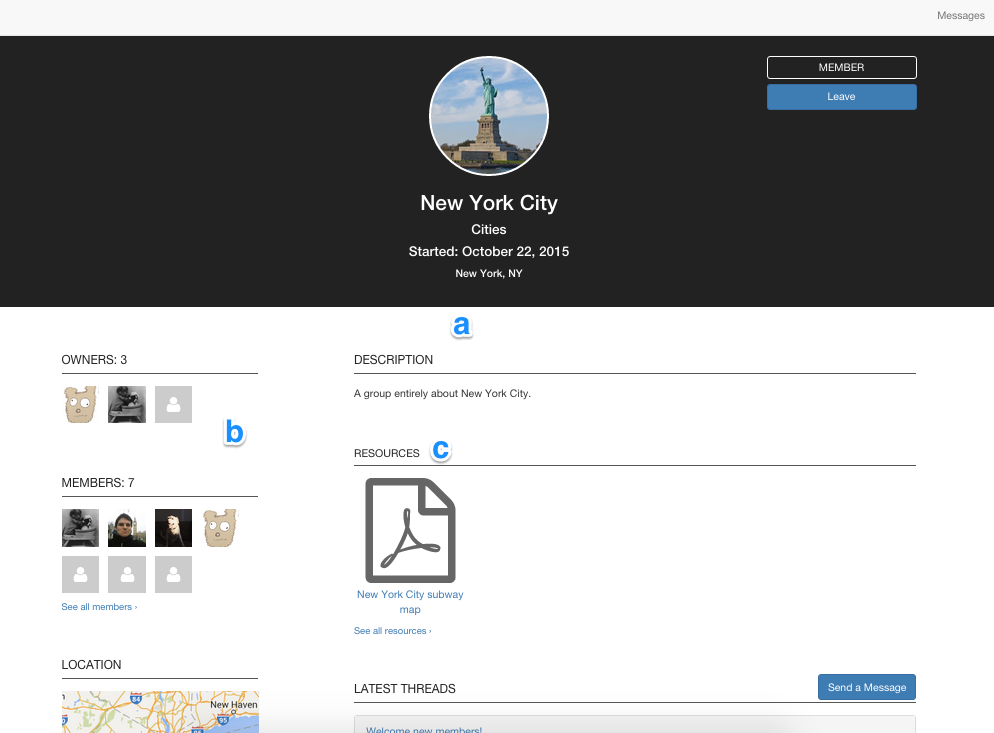

Connect staff members will be designated with a banner that says &ldquo;Staff Member&rdquo;. To find out more information about a group member, click their name to view their profile.

If the group member is also a group owner, you can send them a direct message by clicking the envelope icon to the right of their name. Find more details on messaging group owners in the section of this guide titled Messages on Connect.

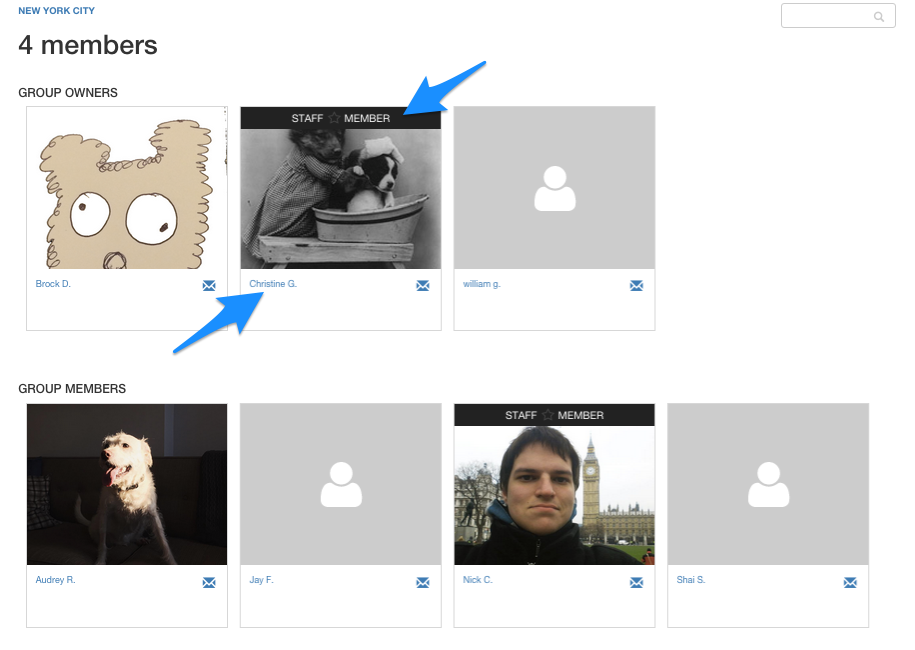

To (c) access group resources, click the name of the resource to view it in a new browser tab. Or, click &ldquo;See all resources&rdquo; to access the Resources page for the group. Find more details on resources in the section of this guide titled Accessing Resources on Connect.

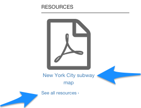

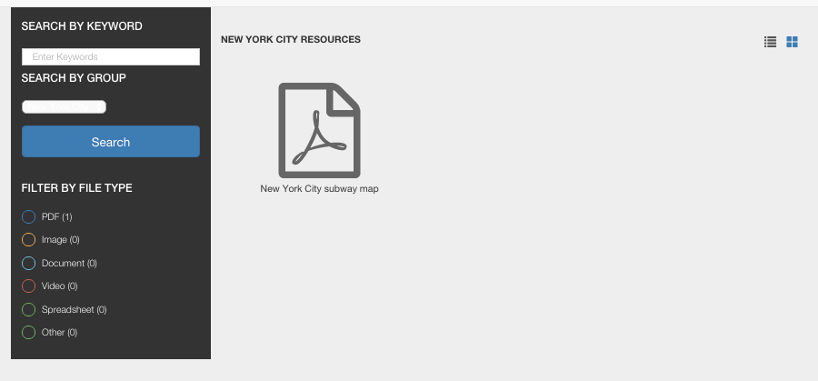

Further down the group page, you can also (d) read the latest threads in the group, (e) send a message in the group (Find more details on sending messages in the section of this guide titled Messages on Connect.), update your (f) group subscription notifications, and (g) find the most popular links posted to the group.

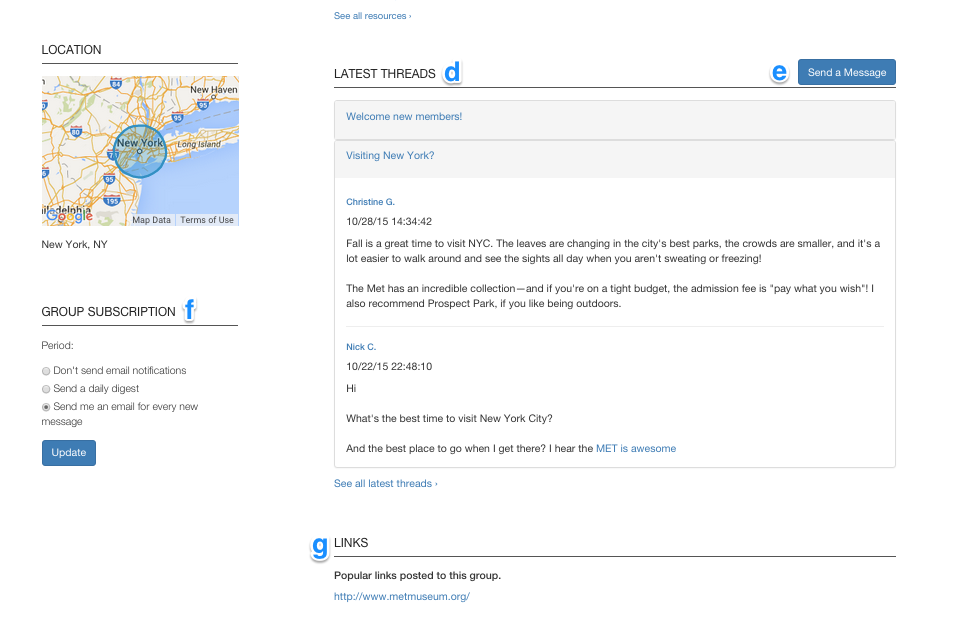

The (d) latest threads view will have all but the most recent threads collapsed. To expand the thread view, click the subject line of a collapsed message.

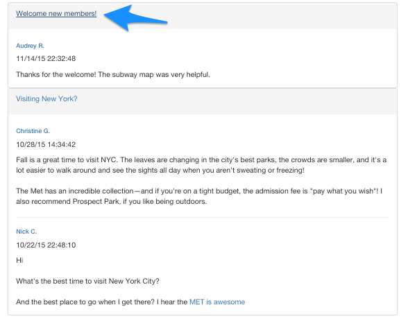

To (f) update your notifications for this group, choose your desired message frequency. Click **Update** to save your changes.

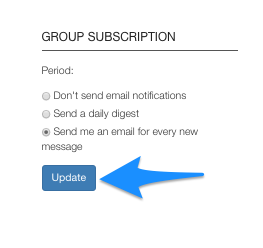

You'll see a confirmation message at the top of the group page indicating your change has been made. Find more details on managing your group subscriptions in the section of this guide titled Managing Connect Subscriptions.

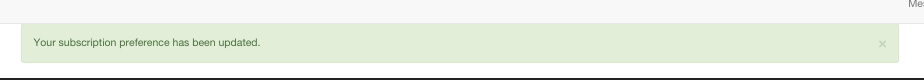

4. Leaving groups

If you've decided you'd no longer like to be a member of a group, there are a few ways you can leave the group.

From the group page, you can end your group membership by clicking the **Leave** button.

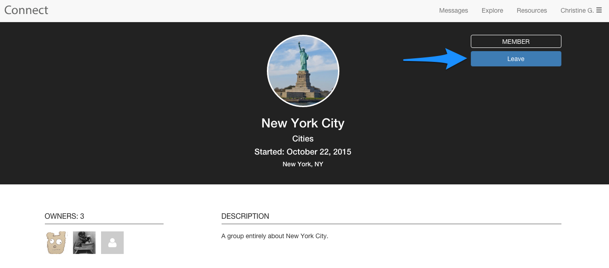

You can also leave groups from your profile by clicking **Leave Group** on the group listing.

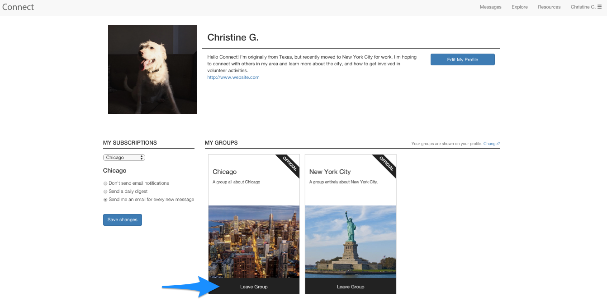

In both cases, you will receive a confirmation dialog box asking if you are sure you'd like to leave the group. Click **Cancel** to stay in the group, or **OK** to leave the group.

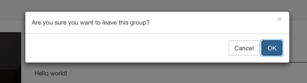

Messages On Connect
===================

Once you become a member of a group on Connect, you'll be able to send and receive group messages. In this section, we'll cover how to:

* Find your new Connect messages
* Reply to messages and compose new messages
* Send messages to Connect administrators
* Flag messages as inappropriate

1. Find and read new messages

When you receive new Connect messages, a badge indicating the number of unread messages you have will appear on the navigation bar. Click **Messages** to go to your inbox.

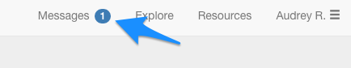

In your Connect inbox, unread messages will appear in bold. To read the full message, click anywhere on the message.

.. image:: images/image43.png

From the message, can read the full text and any replies in the message thread. You can also take several other actions including:

a. Return to the inbox

b. Archive the message

c. Reply to the message thread (Find additional details on this below.)

d. Compose a new message (Find additional details on this below.)

e. Flag the message as inappropriate (Find additional details on this below.)

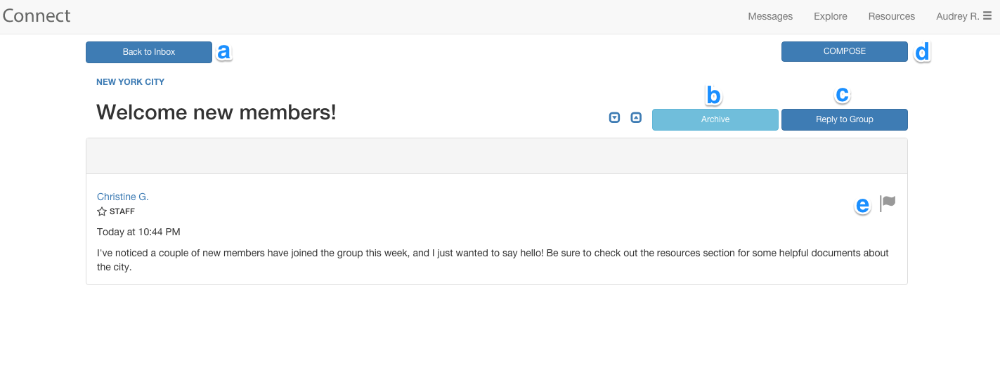

To (a) return to your inbox from the message, simply click the Back to Inbox button. The message will now be marked as read, but will remain in your inbox.

If you'd like to mark the message as read, and archive it so it no longer appears in your inbox, click (b) **Archive**.

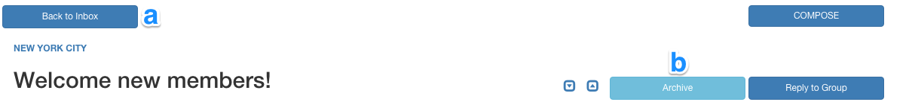

2. Reply to messages and compose new messages

If you'd like to reply to the message, click (c) **Reply to Group**. Compose your message, and click **Send Message**. Your reply will be seen by all members of the group.

Click (d) **Compose** to start a new message thread in a group you're the member of.

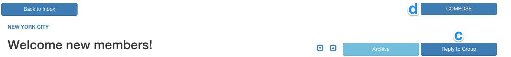

When you (c) send a reply to the message thread, the group name and subject line will be indicated in the compose window.

.. image:: images/image01.png

When you (d) start a new message thread, you'll need to choose the group you want to send the message to and compose a subject line. Click **Send Message** to send your message.

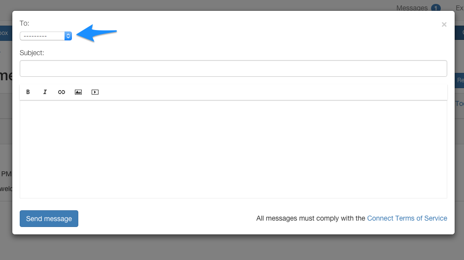

Once you click **Send message**, you will be redirected to your Connect inbox and will be given a confirmation message that it was sent. The sent message will be viewable from your inbox.

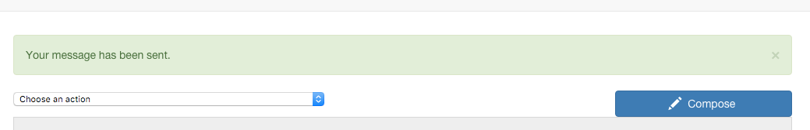

Click on the message to view what you sent, or any replies to it.

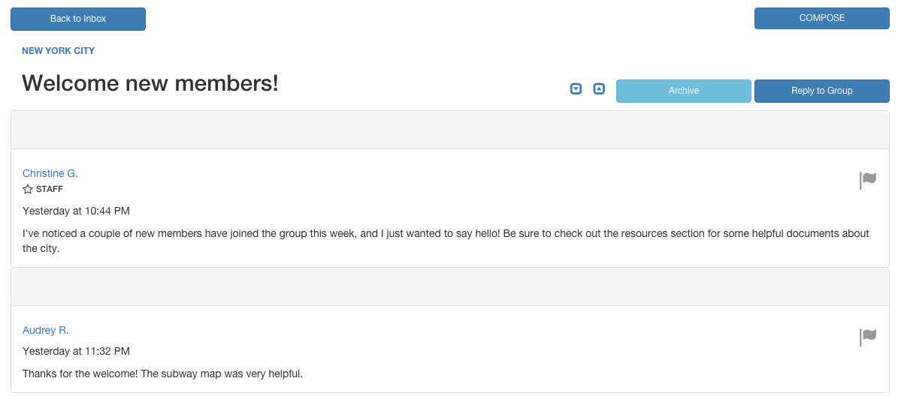

Please note: If the group you are a member of is set as moderated, a group administrator will need to approve your message before it will be viewable by other group members.

3. Send messages to Connect administrators

You can send the owners (or administrators) of your Connect groups direct messages from two places: from the member listing in a group page, or from the administrator's Connect profile. You can access both from the Connect group.

Click **Owners** to send the message from the member listing, or click the administrator's profile picture icon to go to their profile.

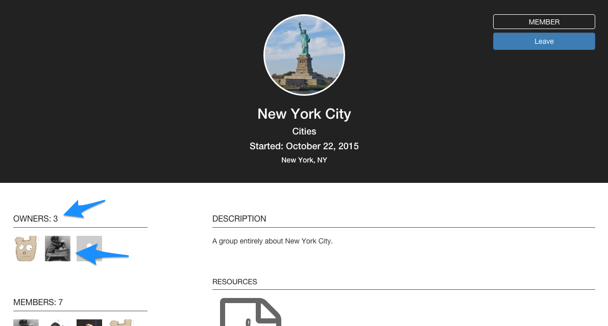

If you choose to click **Owners**, you'll be sent to the group member panel. Find the administrator (owner) you'd like to message and click the envelope icon to the right of their name.

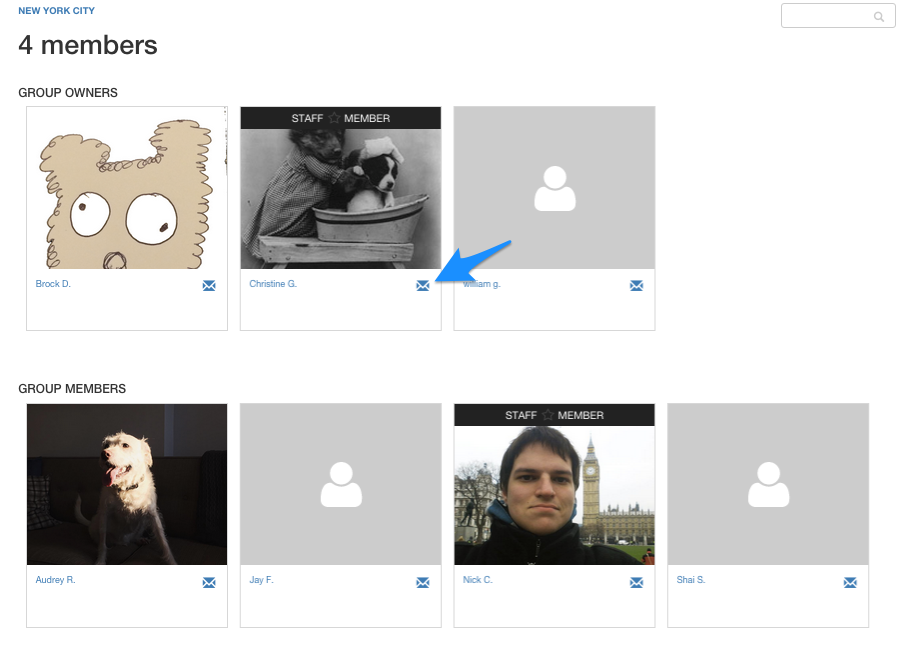

If you choose to click their profile picture icon, you will be sent to the administrator's profile. From here, click the **Send a message** button.

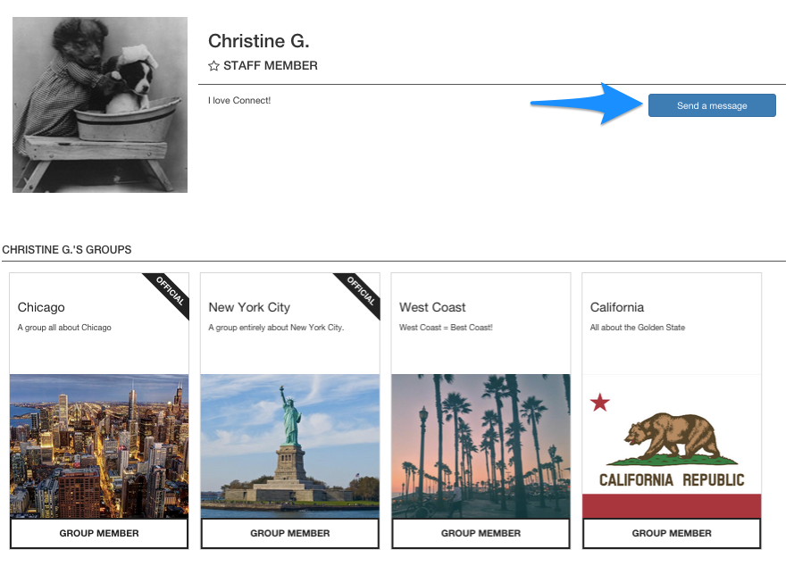

In both cases, after clicking, you will see a compose window. The administrator&#39;s name will be pre-filled, but you'll need to fill in a subject line and message. Click **Send message** when you're done composing your message.

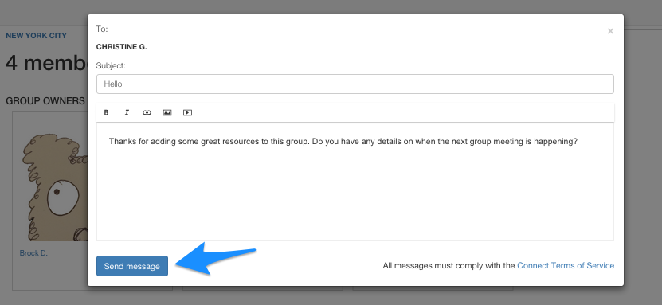

Once you click **Send message**, you will be redirected to your Connect inbox and will be given a confirmation message that it was sent. The sent message will be viewable from your inbox.

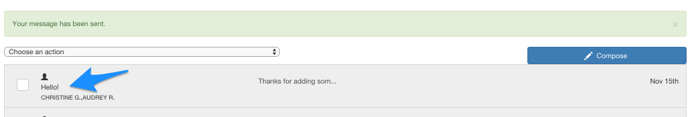

As with other messages, click on the message to view what you sent or any replies to it.

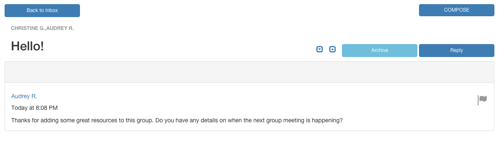

4. Flagging messages

If you receive a message in your inbox that you think is in violation of the Connect Terms of Service, you can (e) flag the message as inappropriate and it will be reviewed by a Connect group administrator.

Click the flag icon in the body of the message.

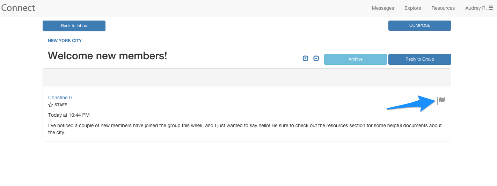

You will receive a message confirming if you would like to flag the message as inappropriate.

Flagged messages will no longer appear in your Connect inbox—unless a group administrator determines the message does not violate Connect Terms of Service.

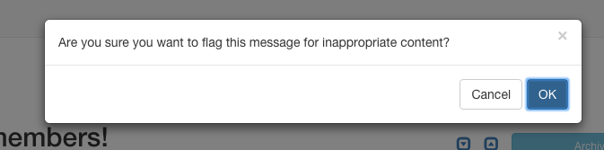

Managing Your Connect Inbox
===========================

Your Connect inbox will contain messages from every group you're a member of, as well as direct messages between you and Connect administrators. To make it as simple as possible to find relevant messages, there are filtering features available on your inbox.

The default view, (a) **Inbox**, will display your entire inbox—this includes any new messages or read messages you have not archived. The (b) **Unread** view contains only new messages you haven't read yet. The (c) **Archive** view contains messages you have marked to be archived.

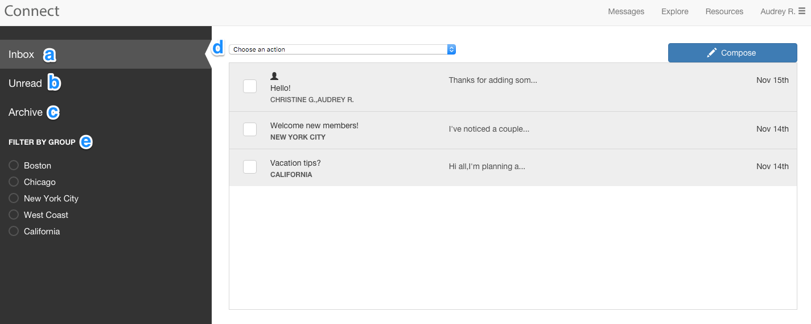

By using the (b) **Choose an action** feature, you can manage your messages in bulk. Select all messages in your inbox, archive all selected messages, or mark the selected messages as read.

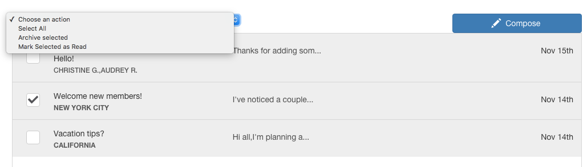

If you're a member of several Connect groups, and would like to just see messages from one group in particular, you can do that by utilizing the (e) **Filter By Group** feature.

Click the circle next to the group name and choose whether you'd like to view the Inbox, Unread or Archive message views.

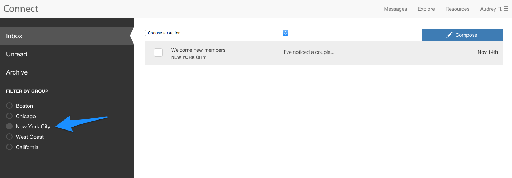

Accessing Resources On Connect
==============================

There are two ways to access resources on Connect. You can access all resources shared with groups you are a member of in the Resources panel. Or, you can access resources in individual groups by clicking select resources from the group's page.

To access the Resources panel, click **Resources** on the Connect navigation bar.

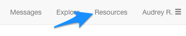

From the Resources panel, you can search for resources by (a) keyword, (b) or by group. You can also (c) filter the resources by file type. Click the file icons under **My Resources** to access them immediately. Depending on the file type, they will either open in a new browser tab, or begin downloading to your computer.

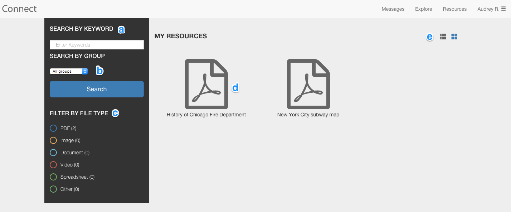

If you prefer you can also (e) change the resource view from grid to list view.

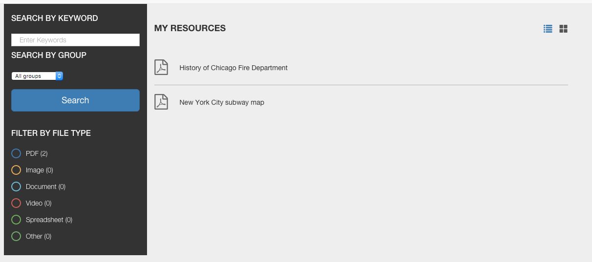

To access resources in groups, click the file icon in the group view to access the file immediately.

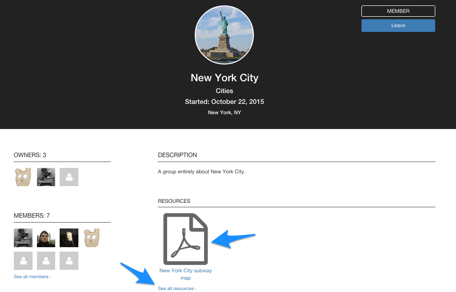

Or click **See all resources** to open the group resources page.

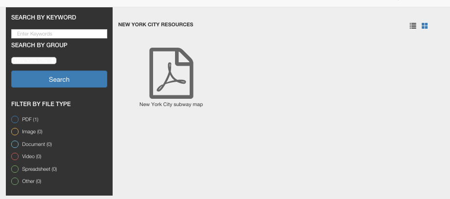

Managing Your Connect Subscriptions
===================================

When you're a member of Connect groups, you will receive messages from the group in your Connect inbox and at the email address you used to create your Connect account.

There are three ways you can make changes to your Connect subscription notifications: (1) From the **Manage My Account** panel, (2) from **My Profile**, and (3) from individual group pages.

1. Edit your subscription notifications from the **Manage My Account** panel by clicking the three lines on the Connect navigation bar, and then clicking **Manage My Account**.

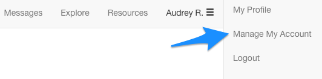

From **Manage My Account**, you can choose default notification settings for all of your subscriptions. Click **Update** to save your changes.

Please note: If you choose to receive no email notifications, or a daily digest, this will apply to all of your Connect messages.

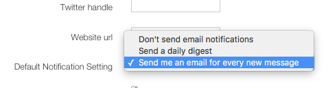

2. Edit your subscription notifications from the My Profile panel by clicking the three lines on the Connect navigation bar, and then clicking **My Profile**.

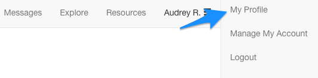

From your profile, under **My Subscriptions**, choose the group you would like to manage your notifications for. Choose from no email notifications, a daily digest, or an email for every new message. Click **Save changes** to update your subscription settings.

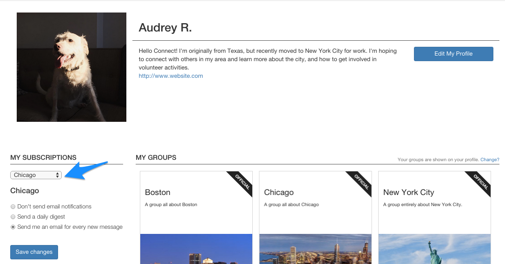

2. Edit your subscription notifications from individual groups by going to the group page and choosing the notification settings.

Choose from no email notifications, a daily digest, or an email for every new message. Click **Update** to save your changes.

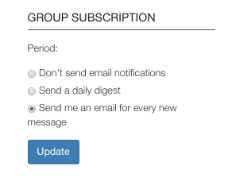
